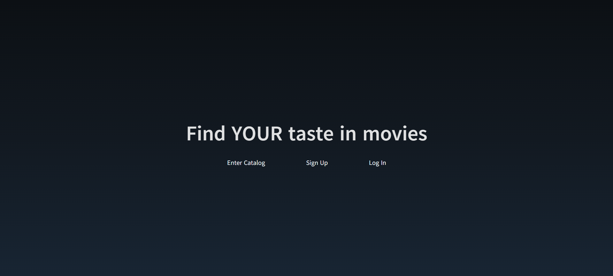
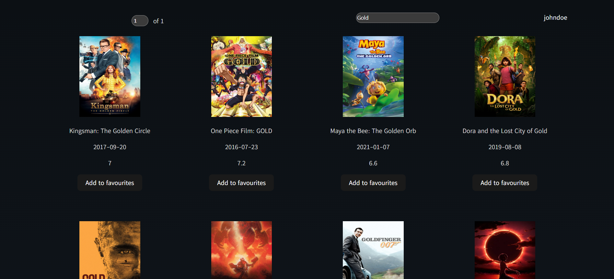
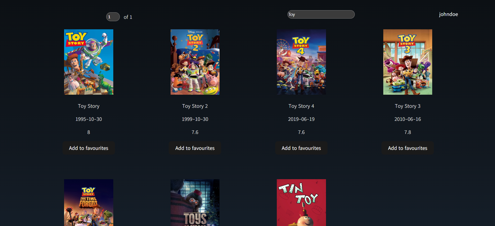
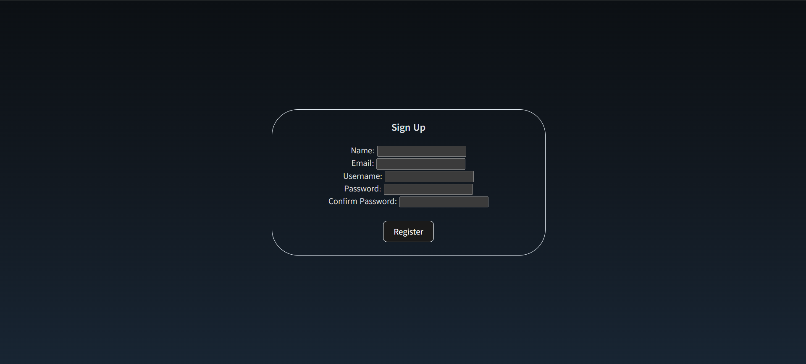
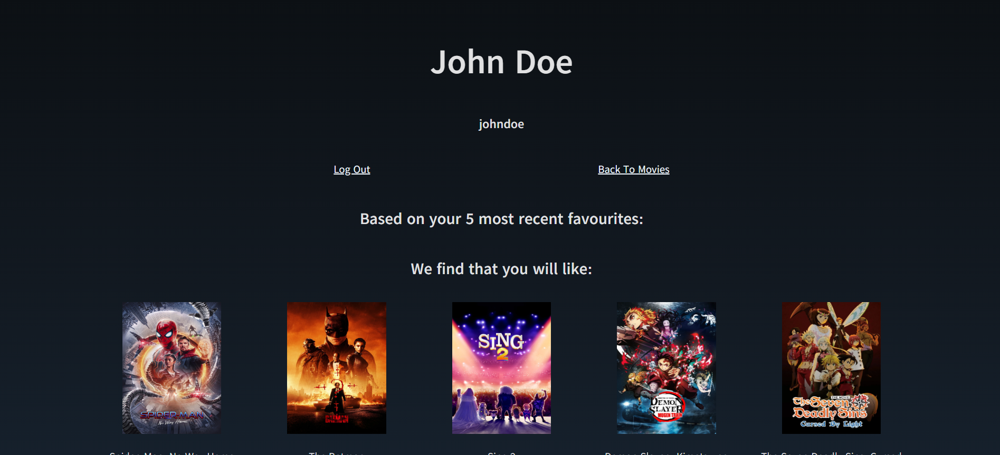
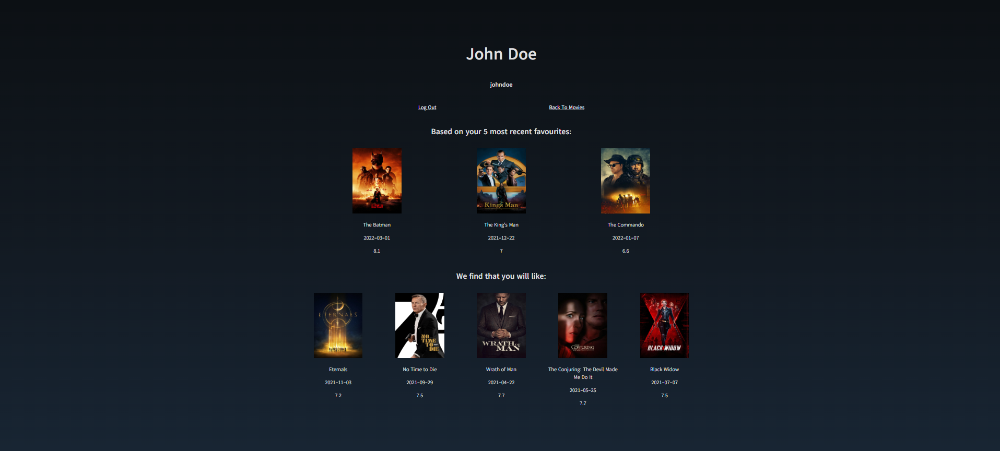

# About This Project

## Movie Catalog

This project is a movie catalog, designed for users to interact with and select their favourite movies out of 9000+ movies present. Moreover, the movie catalog comes with a feature-vector based recommendation system that makes use of cosine similarities to generate recommendations for users based on what movies they like to watch. Authentication to access specific resources is a key feature of this application, as it guarantees that only users who have registered for an account can be able to watch movies.

## Languages and Tools Used

The major languages that I have used for this project are JavaScript, for client-side programming and Java, for server-side programming. For JavaScript, I made use of the React library and Vite build tool in order to develop the client with an object oriented and reactive focus. The Vite build tool was needed since support for configuring a React application alone through `create-react-app` was deprecated. As for the server, I made use of the Spring Boot framework in order to make a web application through Java. Java was selected as the language, particularly due to it's object-oriented nature and so that I can better understand the importance of object-oriented programming in building web applications. 

Besides the client and server, there also exists the H2 in-memory database powered by the server, with queries for set-up and modification written in SQL.

## How To Setup Application on Local Machine

See the Setup.md document in the "docs" folder for more information

## Screenshots

