# How Does The Recommender Work?

One major component of the movie catalog application is the recommendation system, which makes use of feature vectors to relate a movie to the average feature vector taken from all user favourites.

The feature vector is two dimensional. Each value in a feature vector will correspond to either a movie rating or a genre score. 

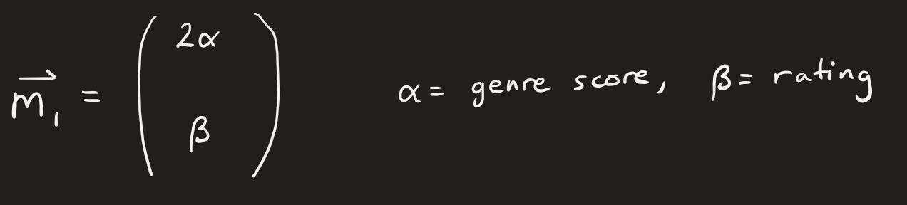

Below is a table that contains a score for each genre.

```json
"Action": 0,
"Adventure": 1,
"Animation": 2,
"Biography": 3,
"Comedy": 4,
"Crime": 5,
"Documentary": 6,
"Drama": 7,
"Family": 8,
"Fantasy": 9,
"Film-Noir": 10,
"History": 11,
"Horror": 12,
"Music": 13,
"Musical": 14,
"Mystery": 15,
"Romance": 16,
"Science Fiction": 17,
"Short": 18,
"Sport": 19,
"Thriller": 20,
"TV Movie": 21,
"War": 22,
"Western": 23
```

For example, say I have 2 different movies: Iron Man and Spirited Away. 

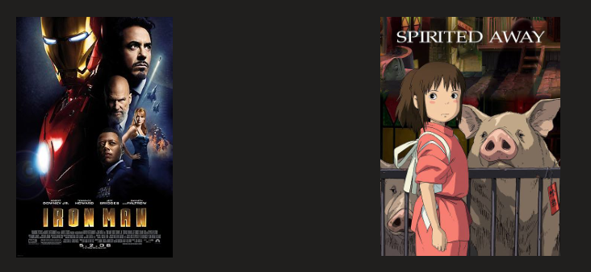

The following genres for Iron Man are:

`Action, Science Fiction, Adventure`

Taking these values and mapping them to their genre score, I get:

`0, 17, 1`

The total of these values are `0 + 17 + 1 = 18`

Thus, 18 is the genre score for Iron Man.

Now let us consider Spirited Away. The following genres for Spirited Away are:

`Animation, Family, Fantasy`

Taking these values and mapping them to their genre score, I get:

`2, 8, 9`

The total of these values are `2 + 8 + 9 = 19`

Thus, 19 is the genre score for Spirited Away.

Given the ratings for the 2 movies and their newly acquired genre score, the following information about these 2 movies is:

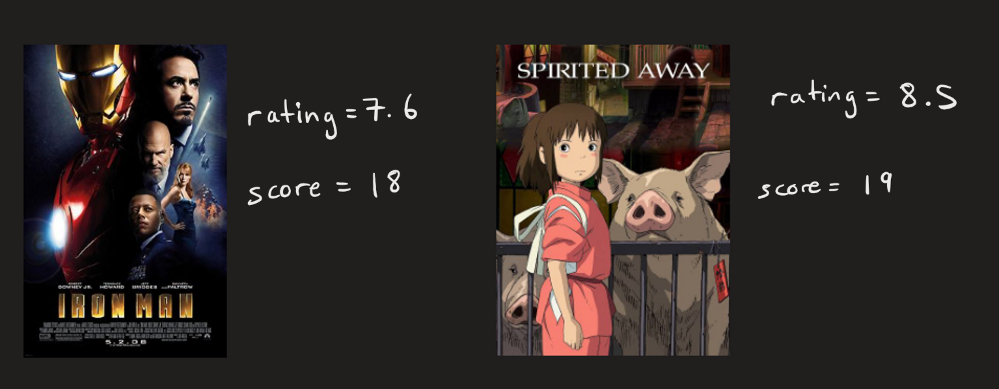

Additionally, the movie rating is scaled by a factor of 1 whereas the genre score is scaled by a factor of 2.


Every movie in the movie repository will have a feature vector associated with it. For a combination of many movies, a feature vector will be obtained by taking the average of all ratings and the average of all genre scores. This is especially relevant since the favourites feature vector is formed this way, with the 5 most recent favourites used for the larger feature vector.

Comparisons between feature vectors are done through cosine similarity. Given vectors `m1` and `m2`, the cosine of the angle between these two vectors is:

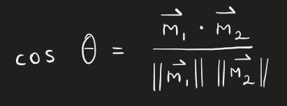

Suppose we map our feature vectors onto a 2 dimensional plane. We find that our feature vectors for our 2 movies will appear on the 2D plane as so:

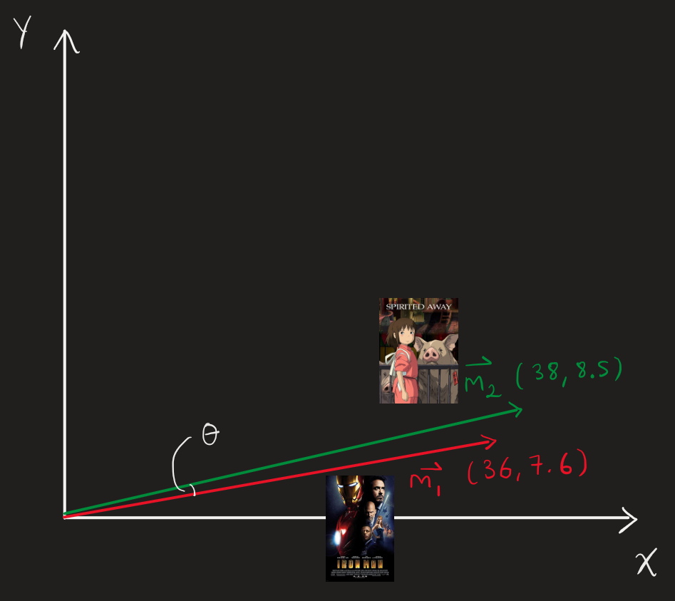

When computing the cosine of the angle between our two vectors, we will find that it is close to 1, meaning that the feature vectors are very close to each other. 

This means that the angle between the two vectors is near zero, making these movies relatively similar in terms of scaled factors such as the genre score and the rating.

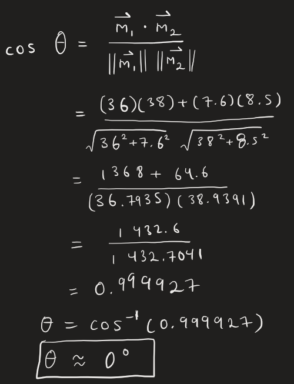

Now suppose I favourited these two movies. Since I have favourited these two movies, my new feature vector for these two favourite vectors will consist of the average genre score of the two movies, scaled, and the average rating on the two movies as well.

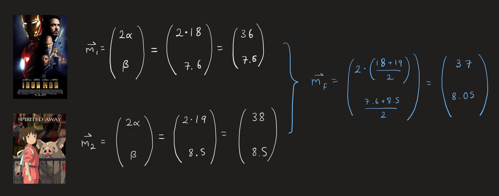

On the 2 dimensional plane, the favourites vector will appear roughly in the middle of the two vectors of the original movies themselves.

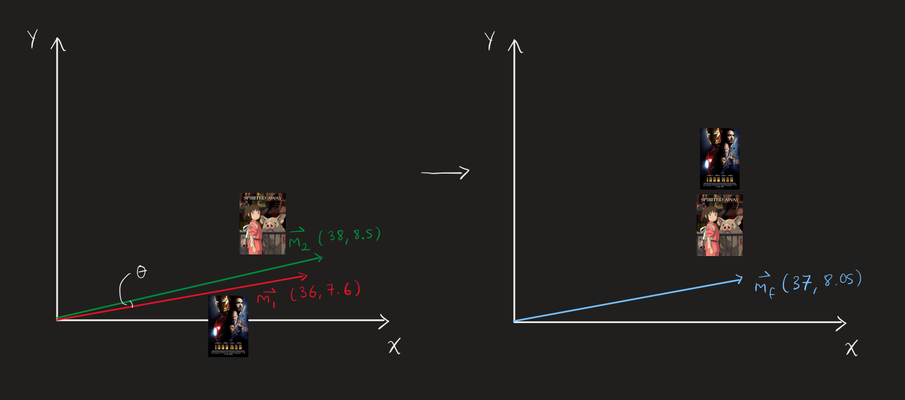

Additionally, I want to compare two more movies to my favourites vector, both being different: Groundhog Day and Kung Fu Panda

The ratings for Groundhog Day and Kung Fu Panda are `7.6` and `7.2` respectively.

Given that the genres for Groundhog Day are `Romance, Fantasy, Drama, Comedy` and those for Kung Fu Panda are `Action, Adventure, Animation, Family, Comedy`, their genre scores will be `16 + 9 + 7 + 4 = 36` and `0 + 1 + 2 + 8 + 4 = 15` respectively.

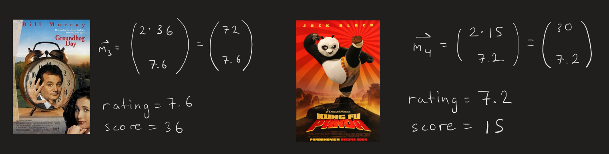

When mapping these vectors on a 2D plane, and when comparing these vectors to the favourite vector, we see that the Kung Fu Panda movie is closer to the favourites vector when compared to the Groundhog Day movie

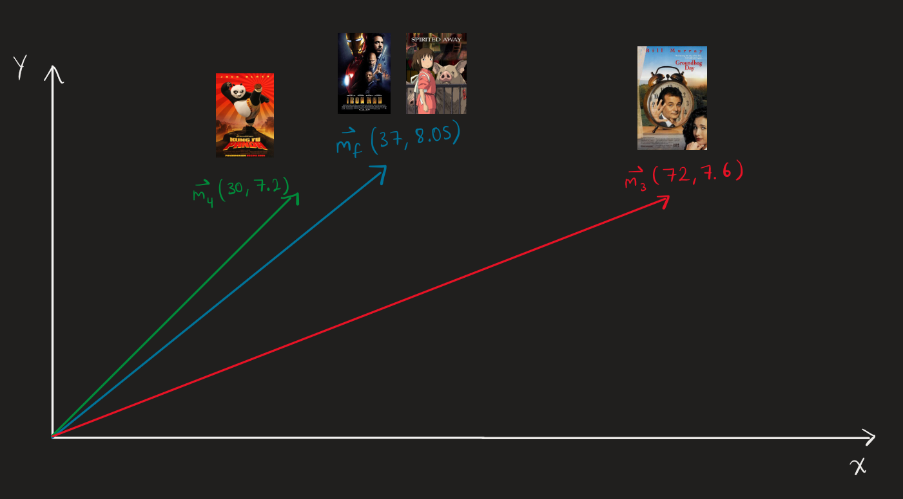

Suppose we assign angles between our vectors with a reference to our movie favourites vector. The first angle will refer to the angle between the Kung Fu Panda movie and our favourites vector. The second angle will refer to the angle between Groundhog Day and our favourites vector.

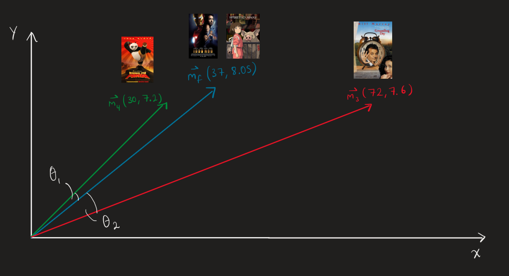

Solving for our angles, we find that the cosine value for the first angle is closer to 1 than the cosine value for the second angle, meaning that the Kung Fu Panda movie is closer in recommendations compared to Groundhog Day.

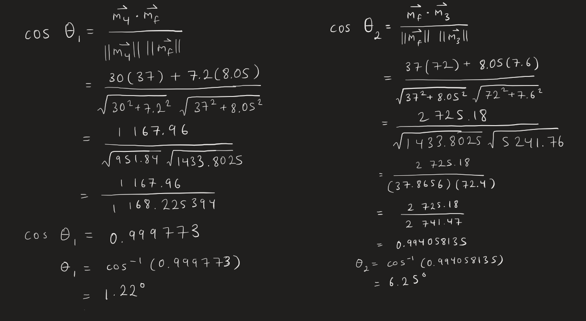

This means that the recommender is more likely to recommend Kung Fu Panda as a user favourite when compared to the Groundhog Day movie.

For the movie catalog application, 5 movies that are closest to a favourites vector out of over 9000 movies in the movie database will be selected as recommendations by the recommender model.